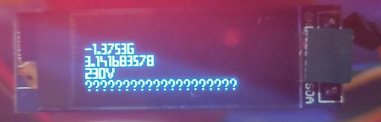

# Library for OLED 128x32 display with SSD1306 controller, to use with stm32 MCU in Cube IDE

  


## Description:
- Library for connection oled display with SSD1306 controller with microcontroller stm32, using i2c interface
- Library provides a basic functionality, like displaying integers, floating point numbers and some characters
- Main objection was to have a possibility to display measurements of e.g. sensors connected to stm32

## Initialization:
- Copy all the header files and source files to your project, include a "OLED_128x32.h" file in main (or file using library's functions)
- Change the #include "stm32f1xx_hal.h" line in OLED_128x32.h , according to your stm32 model
- create a struct "OLED_128x32" (i.e. OLED_128x32 oled; in PV field)
- initialize a struct, passing i2c handle and OLED_128x32 handle with function "Init_OLED_Struct(&oled, &hi2c1);"
- initialize the display, passing OLED_128x32 handle with function "OLED_Init(&oled);"

## API and manual:
- After initialization, all the numbers and chars are from 1'st row and 1'st column.
- Column's number is incremented automatically, according to size of words added, but to go to next line use a function "OLED_Next_Line"
- To clean all the pixels in the struct's buffer and go back to starting position,
 call "OLED_Reset_Display" (to actually reset the screen, subsequently call "OLED_Draw")
 
- You can either add an int number (OLED_Add_number), float number (OLED_Add_Float) or individual chars (OLED_Add_char)(only few so far)
- You can pass as well a dynamic variables to above functions
- After calling a functions adding chars and numbers, to actually draw them on a screen call "OLED_Draw"

## Example:
### Example of using a library to continously display a value read from ADC (code simplified to focus on library's specific functions):
```c
    #include "OLED_128x32.h"
    OLED_128x32 oled;
    float voltage = 0;

    int main(void)
    {
        Init_OLED_Struct(&oled, &hi2c1);
        OLED_Init(&oled);
        OLED_Reset_Display(&oled);

        // loop continously reads new value and updates it on the screen 
        // (also adds 1234567890 on second line)
        while(1)
        {
            voltage = HAL_ADC_GetValue(&hadc) * (3.3f / (float)4095); // map ADC output to volts
            OLED_Reset_Display(&oled); // resets a buffer send to graphic memory
            OLED_Add_Float(&oled, voltage, 4); // voltage value rounded to 4 decimal numbers
            OLED_Add_char(&oled, 'V'); // add 'V' character
            OLED_Next_Line(&oled); // go to next line
            OLED_Add_number(&oled, 1234567890); // add number 1234567890
            OLED_Draw(&oled); // puts a pixels from buffer on the screen
        }
    }
```